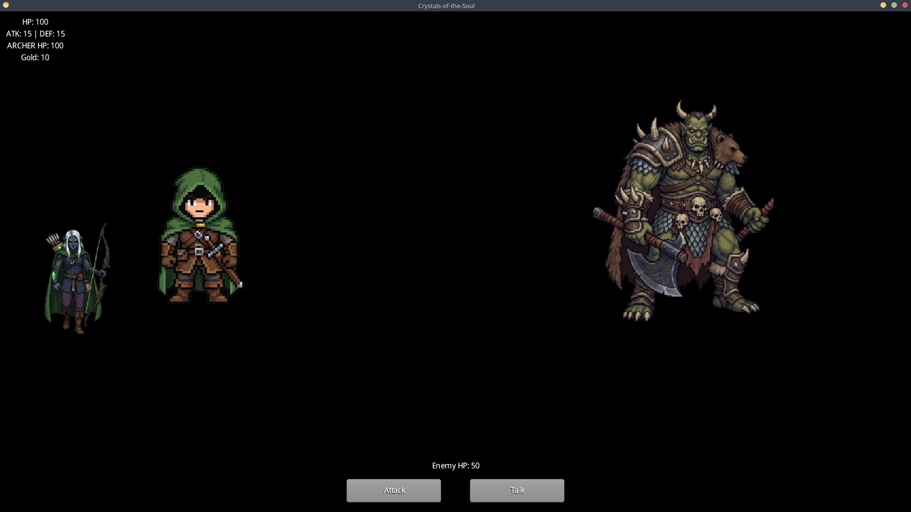
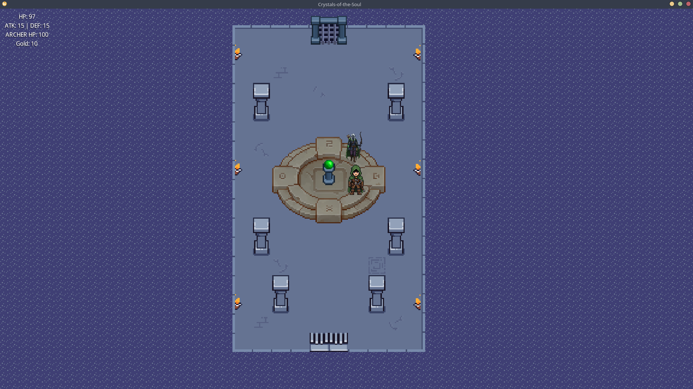
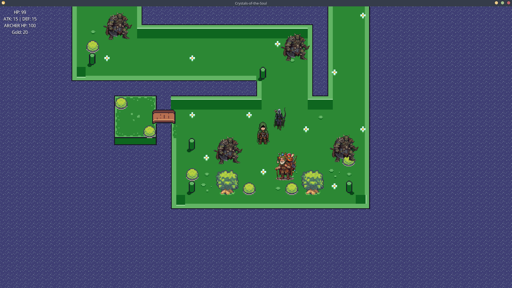

<div align="center">

# Crystals of the Soul

**A morality-driven dungeon-crawler RPG built in Java with libGDX.**

Descend through six floors, and let every choice to *fight* or *spare* shape the crystal you carry, the companion who fights beside you, and the ending you earn.

[](https://www.oracle.com/java/)
[](https://libgdx.com/)
[](https://gradle.org/)
[](https://junit.org/junit5/)
[](LICENSE)

</div>

<div align="center">



<sub>Turn-based combat: the hero and a crystal-assigned companion face off against a floor boss.</sub>

</div>

---

## Table of Contents

- [Overview](#overview)
- [Features](#features)
- [Tech Stack](#tech-stack)
- [Architecture](#architecture)
- [Design Patterns](#design-patterns)
- [Testing](#testing)
- [Getting Started](#getting-started)
- [Project Structure](#project-structure)
- [License](#license)

---

## Overview

**Crystals of the Soul** is a top-down, turn-based RPG in which the player descends through a dungeon of six floors (a tutorial one + 5 actual gameplay floors). Every encounter offers a moral choice: **kill** the enemy or **spare** it. The game keeps a running moral tally, and that tally silently decides the story.

At a certain point the game reads your choices and awards one of three **crystals**:

| Crystal | Earned by | Consequence |
| :------ | :-------- | :---------- |
| 🔴 **Red** | Killing only | Spawns an **Assassin** companion; the player loses the ability to spare |
| 🔵 **Blue** | Sparing only | Spawns a **Protector** companion; the player loses the ability to attack |
| 🟢 **Green** | A mix of both | Spawns an **Archer** companion; keeps every option open |

<div align="center">



<sub>The crystal chamber: a Green crystal is awarded and an Archer companion joins the hero.</sub>

</div>

The crystal reshapes gameplay in real time (which maps load, which companion joins, which actions the hero may take) and, together with the final moral balance, resolves into one of several distinct **endings** through a strategy-based ending system.

This project was built as a university software-engineering project with a deliberate focus on **clean architecture, design patterns, and automated testing** rather than on the game engine alone.

## Features

**Gameplay**
- Six-floor dungeon with crystal-dependent map variants
- Turn-based battle system with an attack / spare decision loop
- Consequence-driven **morality system** that branches the entire second half of the game
- A dynamically spawned **AI companion** (Assassin, Archer, or Protector) with class-specific combat behavior
- Floor bosses on floors 4 and 5 that change with the active crystal
- Shop, gold economy, and an inventory of consumables and equipment (swords, armor, potions, elixirs)
- Multiple branching **endings** resolved from the player's cumulative choices

**Engineering**
- Strict **Model-View-Controller** separation with enforced package boundaries
- Five classic **design patterns** applied where they earn their keep (see below)
- **JSON save/load** with autosave-on-floor-change and tamper/corruption validation
- **74 production classes** backed by **33 JUnit 5 test classes** running on libGDX's headless backend
- Multi-module **Gradle** build producing a cross-platform runnable JAR

<div align="center">



<sub>Exploring a floor: enemies to fight or spare, a shopkeeper to trade with, and the exit ahead.</sub>

</div>

## Tech Stack

| Area | Technology |
| :--- | :--------- |
| Language | Java 8 |
| Game framework | [libGDX](https://libgdx.com/) 1.14.0 |
| Entity / AI helpers | Ashley, gdx-ai |
| Screen management | libgdx-screenmanager, universal-tween-engine |
| Build | Gradle (multi-module, wrapper included) |
| Testing | JUnit 5, libGDX headless backend |
| Desktop backend | LWJGL3 |

## Architecture

The codebase follows a clean **MVC** layering. The model contains zero rendering code and has no dependency on the view, which keeps game logic fully unit-testable in a headless environment.

```
core/src/main/java/io/github/crystals_of_the_soul/
├── model/        Game state, entities, items, bosses, endings (pure logic, no rendering)
├── view/         libGDX screens, HUD, animation, rendering
└── controller/   Input handling, battle flow, interactions, collisions, floor transitions
```

- **Model** holds the authoritative `GameState` (floor, moral counters, crystal, players, gold), entities, the item and boss hierarchies, and the ending logic.
- **View** owns the libGDX `Screen` implementations (menu, game, inventory HUD, ending screen) and all animation, and it reacts to model changes through observers.
- **Controller** mediates input and game rules: the turn-based `BattleManager`, interaction strategies, collision handling, and the `FloorTransitionService` that drives descent and autosave.

UML class diagrams for the key subsystems live in [`UML/`](UML/):

| Subsystem | Diagram |
| :-------- | :------ |
| Enemy hierarchy & behaviors | [`UML/Enemy.png`](UML/Enemy.png) |
| Companion (Player 2) system | [`UML/Player2.png`](UML/Player2.png) |
| Shop & NPC interaction | [`UML/Shop.png`](UML/Shop.png) |

## Design Patterns

The project uses five well-known patterns, each in a place where it removes real duplication or coupling:

| Pattern | Where | Why |
| :------ | :---- | :-- |
| **Strategy** | `InteractionStrategy` (enemy / item / shop / use-item), `EndingStrategy` (Hero, Citizen, Guardian, Wanderer, Choice), enemy `*Behavior` classes | Swap behavior at runtime without conditionals scattered through the controller |
| **Factory** | `BossFactory` (per floor and crystal), `Player2Factory`, `ShopNPCFactory`, `ItemEffectFactory`, `GameStateFactory` | Centralize object creation and keep construction logic out of the callers |
| **Observer** | `InventoryObserver` → `InventoryUiObserver` | Decouple inventory model changes from the HUD so the view updates itself |
| **Singleton** | `SaveManager`, `SettingsManager` | A single, shared owner for persistence and configuration |
| **State** | `PlayerState`, `Player2State`, battle turn flow | Model per-entity mutable state cleanly and make it serializable |


## Testing

Game logic is covered by **33 JUnit 5 test classes** that run against libGDX's **headless backend**, so the model and controller are verified without launching a window or rendering a frame. Coverage spans the systems most likely to break:

- **Combat** – `BattleManagerTest`, `EnemyTest`, boss behavior and factory tests
- **Morality & endings** – `CrystalPredictionTest`, `EndingResolverTest`, `EndingStrategyTest`
- **Companion system** – `Player2*` movement, init, battle-behavior, and integration tests
- **Inventory & items** – `InventoryTest`, `InventoryObserverTest`, `ItemConsumabilityTest`
- **Persistence** – `SaveManagerTest`, save-integrity validation
- **Interactions & world** – enemy / shop / item interaction tests, floor-transition and spawn-resolver tests

Run the full suite:

```bash
./gradlew test
```

## Getting Started

### Prerequisites

- **JDK 8** or newer
- No global Gradle install required; the wrapper (`./gradlew`) is bundled

### Run the game

```bash
git clone https://github.com/arcamauro/Crystals-of-the-Soul.git
cd Crystals-of-the-Soul
./gradlew lwjgl3:run
```

### Build a runnable JAR

```bash
./gradlew lwjgl3:jar
# output: lwjgl3/build/libs/Crystals-of-the-Soul-1.0.0.jar
java -jar lwjgl3/build/libs/Crystals-of-the-Soul-1.0.0.jar
```

### Run the tests

```bash
./gradlew test
```

> On Windows, use `gradlew.bat` in place of `./gradlew`.

## Project Structure

```
Crystals-of-the-Soul/
├── core/                 Shared game logic (model, view, controller) + tests
│   └── src/
│       ├── main/java/    74 production classes
│       └── test/java/    33 JUnit 5 test classes
├── lwjgl3/               Desktop launcher (LWJGL3 backend)
├── assets/               Maps (Tiled .tmx), sprites, UI skin, saves
├── UML/                  Class diagrams for key subsystems
├── build.gradle          Root multi-module build
└── gradlew / gradlew.bat Gradle wrapper
```

## License

Released under the [MIT License](LICENSE)
